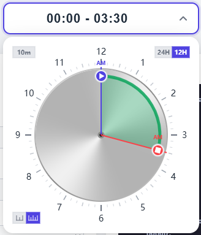

# trPicker — 圆形时间范围选择器

**版本：1.1.1**

一个基于 SVG 的圆形时间范围选择器，支持 **24 小时制** / **12 小时制**。通过拖拽手柄即可选择时间范围。

[](https://limpochen.github.io/trpicker/) [](https://www.npmjs.com/package/trpicker) [](https://www.npmjs.com/package/trpicker) [](https://github.com/limpochen/trpicker/blob/main/LICENSE)



---

## 快速上手

### 安装

```bash
npm install trpicker
```

### ES Module

```js
import trPicker from 'trpicker';

const picker = new trPicker(document.getElementById('picker'), {
    hourCycle: 24,
    startMinute: 0,
    endMinute: 360,          // 06:00
    stepMinute: 10,
});
```

### CommonJS

```js
const trPicker = require('trpicker');

const picker = new trPicker(document.getElementById('picker'), {
    hourCycle: 24,
});
```

### 浏览器 `<script>` / CDN

IIFE 产物会暴露全局 `trPicker`：

```html
<!-- CDN（unpkg / jsdelivr） -->
<script src="https://unpkg.com/trpicker/dist/trpicker.iife.js"></script>
<!-- 或 -->
<script src="https://cdn.jsdelivr.net/npm/trpicker/dist/trpicker.iife.js"></script>
<!-- 或本地引用 -->
<script src="node_modules/trpicker/dist/trpicker.iife.js"></script>

<!-- 2. 容器 -->
<div id="picker" style="width:320px;height:320px;"></div>

<script>
const picker = new trPicker(document.getElementById('picker'), {
    hourCycle: 24,
    startMinute: 0,
    endMinute: 360,          // 06:00
    stepMinute: 10,
    onChange: (start, end) => {
        const fmt = m => `${String(Math.floor(m/60)).padStart(2,'0')}:${String(m%60).padStart(2,'0')}`;
        console.log(fmt(start), '-', fmt(end));
    },
});
</script>
```

### 弹出模式

```html
<input type="text" id="trigger" readonly placeholder="Select a time range">

<script>
const picker = new trPicker(document.getElementById('trigger'), {
    hourCycle: 24,
    popup: true,
    onChange: (start, end) => {
        const fmt = m => `${String(Math.floor(m/60)).padStart(2,'0')}:${String(m%60).padStart(2,'0')}`;
        document.getElementById('trigger').value = `${fmt(start)} - ${fmt(end)}`;
    },
});
</script>
```

---

## 配置项

| 选项 | 类型 | 默认值 | 说明 |
|--------|------|---------|-------------|
| `hourCycle` | `12 \| 24` | `24` | 小时制 |
| `startMinute` | `number` | `0` | 初始开始分钟 0–1439 |
| `endMinute` | `number` | `360` | 初始结束分钟 0–1439 |
| `startHour` | `number` | — | 初始开始小时（浮点数，替代 startMinute） |
| `endHour` | `number` | — | 初始结束小时（浮点数，替代 endMinute） |
| `stepMinute` | `number` | `10` | 吸附步长（分钟） |
| `startColor` | `string` | `'#4f46e5'` | 开始手柄颜色 |
| `endColor` | `string` | `'#ef4444'` | 结束手柄颜色 |
| `lineColor` | `string` | `'#28a050'` | 弧线颜色；`'gradient'` 表示渐变 |
| `detailLevel` | `'simple' \| 'detailed'` | `'simple'` | 表盘刻度精细度 |
| `dialStyle` | `'solid' \| 'metal'` | `'solid'` | 表盘材质样式 |
| `popup` | `boolean` | `false` | 是否使用弹出模式 |
| `popupAnimation` | `'fade' \| 'drop' \| 'instant'` | `'fade'` | 弹出动画 |
| `popupBorderRadius` | `number` | `16` | 弹窗面板圆角半径（px） |
| `enableFineSlider` | `boolean` | `true` | 是否显示微调滑条 |
| `enableModeSwitch` | `boolean` | `true` | 是否在界面显示 12/24H 切换 |
| `enableStepAdjust` | `boolean` | `true` | 是否显示步长选择器 |
| `enableDetailAdjust` | `boolean` | `true` | 是否显示精细度切换 |
| `enableMinStep` | `boolean` | `true` | 强制最小间隔不小于 stepMinute |
| `amText` | `string` | `'AM'` | AM 标签（12H） |
| `pmText` | `string` | `'PM'` | PM 标签（12H） |
| `onChange` | `fn(start, end)` | — | 时间变化回调 |

---

## API

### 方法

| 方法 | 说明 |
|--------|-------------|
| `setStep(minute)` | 修改吸附步长 |
| `setStartColor(color)` | 设置开始颜色 |
| `setEndColor(color)` | 设置结束颜色 |
| `setLineColor(color)` | 设置弧线颜色；`'gradient'` 表示渐变 |
| `setDetailLevel('simple'\|'detailed')` | 切换刻度精细度 |
| `setDialStyle('solid'\|'metal')` | 切换表盘样式 |
| `setHourCycle(12\|24)` | 切换小时制 |
| `getDateTimeValues(baseDate?)` | 返回 `{ startDay, endDay, durationMin }` |
| `open()` | 打开弹出面板 |
| `close()` | 关闭弹出面板 |
| `toggle()` | 切换弹出面板 |
| `destroy()` | 销毁组件并释放资源 |

### 属性

| 属性 | 类型 | 说明 |
|----------|------|-------------|
| `startMinute` | `number` | 当前开始分钟 0–1439 |
| `endMinute` | `number` | 当前结束分钟 0–1439 |
| `hourCycle` | `number` | 当前小时制 `12` / `24` |

---

## 样式定制

CSS 类名均以 `trpicker-` 为前缀；可通过覆盖这些类来自定义外观。

| 类名 | 用途 |
|-------|---------|
| `.trpicker-popup` | 弹窗面板容器 |
| `.trpicker-overlay` | 弹窗遮罩 |
| `.trpicker-fine-slider` | 微调滑条 |
| `.trpicker-hour` | 表盘数字（默认为内置 SVG 属性；需要时再覆盖） |
| `.trigger-input` | 触发输入框（由使用者定义） |

组件不会干预使用者的显示样式。请在 `onChange` 回调中自行格式化并更新界面。
| `.trpicker-fine-slider` | 微调滑条容器 |
| `.trpicker-fine-track` | 滑条轨道 |
| `.trpicker-fine-thumb` | 滑条滑块 |
| `.trpicker-fine-label` | 滑条时间标签 |

---

## 浏览器支持

- 现代浏览器（Chrome、Firefox、Safari、Edge）
- 需要支持 SVG、Pointer Events 与 Touch Events
- 不支持 IE 11 及更低版本
